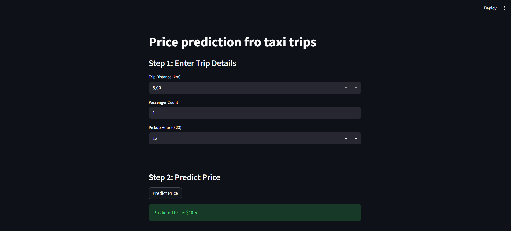
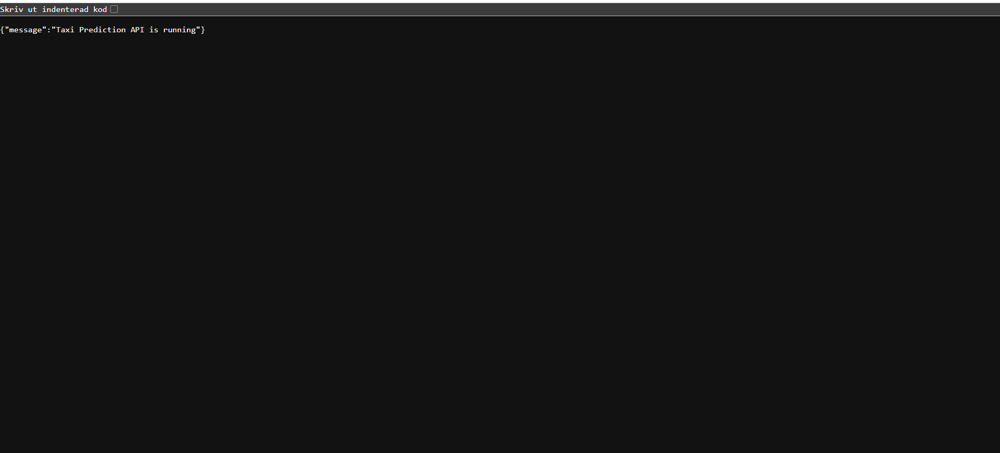

# Taxi Price Prediction

Project to predict taxi prices using machine learning.

## Structure

- `src/taxipred/data/` - dataset  
- `src/taxipred/model_development/` - EDA notebook and model training  
- `src/taxipred/backend/` - FastAPI backend  
- `src/taxipred/frontend/` - Streamlit app  
- `src/taxipred/backend/models/` - saved model  

## How to run

### 1. Install dependencies
```bash
pip install -r requirements.txt 
```
### 2 Train model 
```bash
src/taxipred/model_development/final.ipynb
```

### 3 Start Backend
```bash
cd src/taxipred/backend
uvicorn api:app --reload
```
### 4 Streamlit frontend
```bash
cd src/taxipred/frontend
streamlit run app.py
```
### API Endpoints
- `GET /` - Welcome message
- `POST /predict` - Predict price


## Screenshots

### Streamlit Frontend


### API Documentation


### Made By 
SALAH
