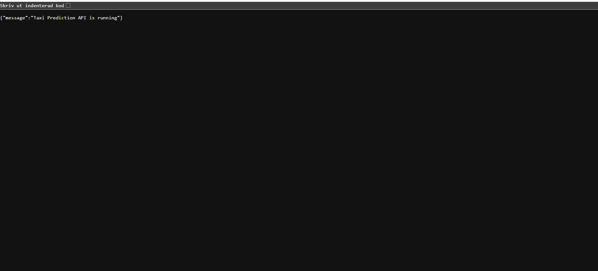
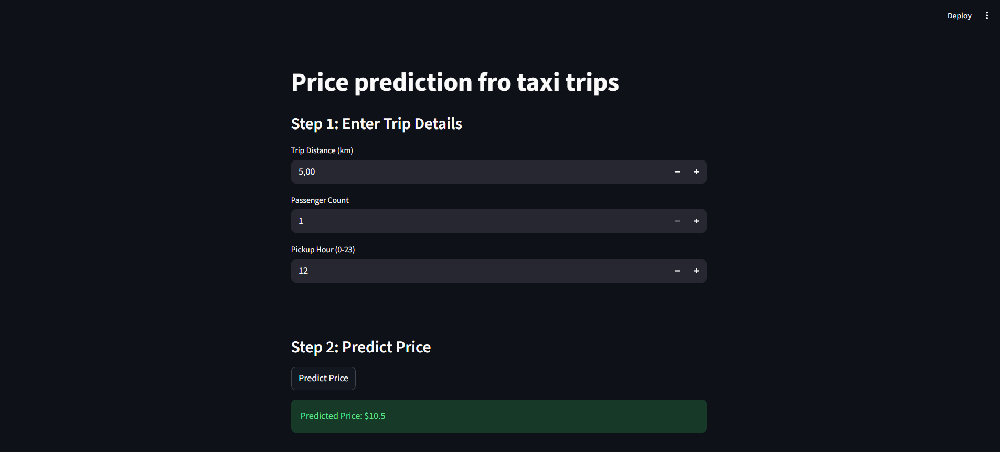

# Taxi Price Prediction – Fullstack Project

## Description
This project predicts taxi prices using a machine learning model.
The application consists of a FastAPI backend and a Streamlit frontend.
The backend serves predictions through an API and the frontend consumes this API.

---

## Project Structure
taxi-prediction-fullstack--Salah-Ud-Din-
├── src/
│   └── taxipred/
│       ├── backend/
│       │   ├── api.py
│       │   └── data_processing.py
│       ├── data/
│       │   └── taxi_trip_pricing.csv
│       ├── frontend/
│       │   └── app.py
│       ├── model_development/
│       │   ├── models/
│       │   ├── eda.ipynb
│       │   └── model_dev.ipynb
│       └── utils/
│           └── __init__.py
├── README.md
├── requirements.txt
└── .gitignore


---

## Machine Learning
- Performed EDA on taxi trip data
- Cleaned data and removed outliers
- Trained a regression model
- Exported the model using `joblib`

---

## Backend (FastAPI)
The backend exposes the following endpoints:

- `GET /` – API health check
- `GET /data` – Returns sample taxi data
- `POST /predict` – Returns predicted taxi price

Example request:
```json
{
  "trip_distance": 5.0,
  "passenger_count": 1,
  "pickup_hour": 12
}


---

## Frontend (Streamlit)
The frontend is built using Streamlit and allows the user to:
- Enter trip distance
- Enter passenger count
- Enter pickup hour
- Get a predicted taxi price from the backend API

---

## How to Run the Project

### 1. Create and activate virtual environment
```bash
python -m venv venv
source venv/Scripts/activate   # Windows

#all packages installation
pip install -r requirements.txt

#Run the Backend
cd src/taxipred/backend
uvicorn taxipred.backend.api:app --reload
#and it will run at 
http://127.0.0.1:8000

#Running the frontend
cd src/taxipred/frontend
streamlit run app.py







Technologies used in this project
Python 
Pandas
scikit-learn
FadtApi
Streamlit
Joblib
Git & Github
